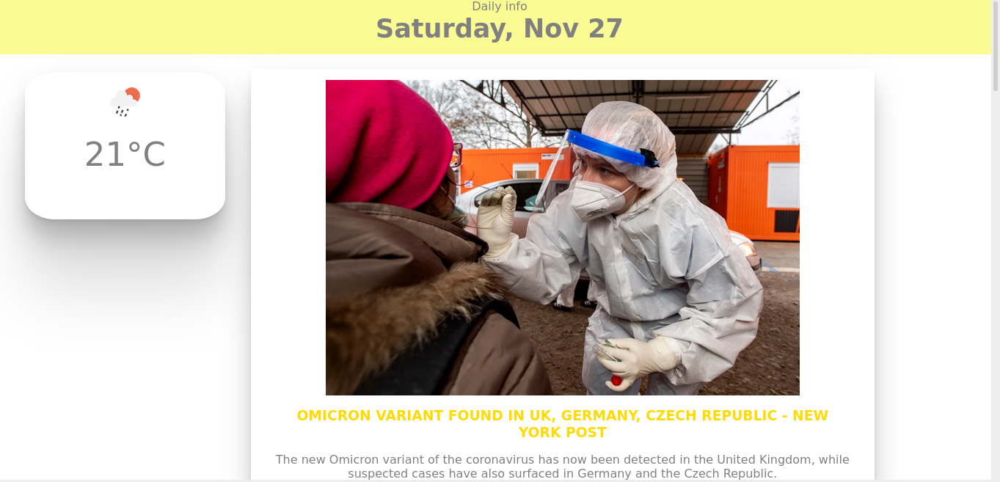

# Daily info
### provides the current weather and news headlines

The app calls openweather api to get the current weather 
It also calls news api to fetch new headlines 

built using react, utilises useEffect 

The UI is til a work in progress
- would love to get the users location automatically using  browser geolocation api( tried it and wasnt successful)
- add other features to it 

### Preview 

